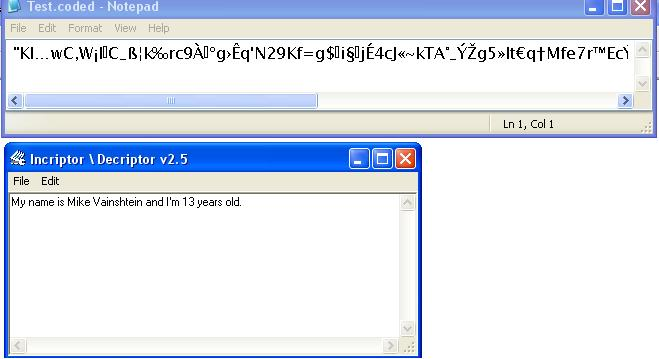



## An Encryptor Decryptor

### Description

This programm demonstrates a simple but useful encryption. Also has several channels (encryption modes). Random characters are added between the transformed original eltters..
 
### More Info
 
Transforms each letter into another according to the ascii code. betwen each transformed letter, random characters are added. The file has an extantion of .coded 

----

Thats all.

             |
---                |---
**Submitted On**   |2003-07-13 11:45:44
**By**             |[Michael Vainshtein](https://github.com/Planet-Source-Code/PSCIndex/blob/master/ByAuthor/michael-vainshtein.md)
**Level**          |Advanced
**User Rating**    |4.0 (24 globes from 6 users)
**Compatibility**  |VB 3\.0, VB 4\.0 \(16\-bit\), VB 4\.0 \(32\-bit\), VB 5\.0, VB 6\.0, VB Script, ASP \(Active Server Pages\) , VBA MS Access, VBA MS Excel
**Category**       |[Files/ File Controls/ Input/ Output](https://github.com/Planet-Source-Code/PSCIndex/blob/master/ByCategory/files-file-controls-input-output__1-3.md)
**World**          |[Visual Basic](https://github.com/Planet-Source-Code/PSCIndex/blob/master/ByWorld/visual-basic.md)
**Archive File**   |[An\_Encrypt1615537162003\.zip](https://github.com/Planet-Source-Code/michael-vainshtein-an-encryptor-decryptor__1-46937/archive/master.zip)

